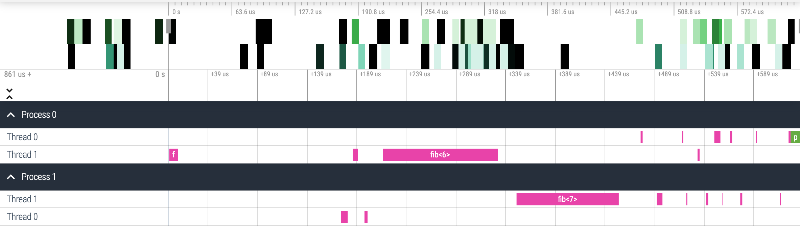

# TTG
This is the C++ API for the Template Task Graph (TTG) programming model for flowgraph-based composition of high-performance algorithms executable on distributed heterogeneous computer platforms. The TTG API abstracts out the details of the underlying task and data flow runtime; the current realization is implemented using [MADNESS](https://github.com/m-a-d-n-e-s-s/madness) and [PaRSEC](https://bitbucket.org/icldistcomp/parsec.git) runtimes as backends.

# Why TTG?

- TTG marries the idea of flowgraph programming models with the key innovations in the PARSEC runtime for compact specification of DAGs (PTG).
- TTG can be used to efficiently compose and execute irregular computation patterns which are poorly served by the current programming and execution models.
- TTG has strong support for distributed hybrid architectures for running modern scientific algorithms efficiently on current and near-future supercomputers.

# Installation

- To try out TTG in a Docker container, install Docker, then execute `bin/docker-build.sh` and follow instructions in `bin/docker.md`;
- See [INSTALL.md](https://github.com/TESSEorg/ttg/blob/master/INSTALL.md) to learn how to build and install TTG.

# A Short Intro to TTG

## TL;DR: A "Hello, World" TTG Program

`helloworld.cpp`
```cpp
#include <ttg.h>

int main(int argc, char *argv[]) {
  ttg::initialize(argc, argv);

  auto tt = ttg::make_tt([]() { std::cout << "Hello, World!"; });

  ttg::make_graph_executable(tt);
  ttg::execute();
  if (ttg::get_default_world().rank() == 0) tt->invoke();
  ttg::fence();

  ttg::finalize();
  return 0;
}
```

`CMakeLists.txt`
~~~~~~~~~~~~~{.cmake}
cmake_minimum_required(VERSION 3.19)
project(TTG-HW CXX)

find_package(ttg QUIET) # check if TTG is already available
if (NOT TARGET ttg-parsec) # else build from source
  include(FetchContent)
  FetchContent_Declare(ttg GIT_REPOSITORY https://github.com/TESSEorg/ttg.git)
  FetchContent_MakeAvailable( ttg )
endif()

add_executable(hw-parsec helloworld.cpp)
target_link_libraries(hw-parsec PRIVATE ttg-parsec)
target_compile_definitions(hw-parsec PRIVATE TTG_USE_PARSEC=1)
~~~~~~~~~~~~~

Configure + build:
```shell
> cmake -S . -B build && cmake --build build --target hw-parsec
```

## "Hello, World!" Walkthrough

Although it does not involve any useful flow of computation and/or data, the above "Hello, World!" TTG program introduces several key TTG concepts and illustrates what you need to do to write a complete TTG program. So let's walk through it.

### Programming Model

The basic model of computation is built around a Template Task Graph (TTG). A TTG consists of one or more connected Template Task (TT) objects. Each message that travels between TTs consist of a (potentially void) task ID and (optional) datum. A TT creates a task for a given task ID when its every input terminal receives a message with that task ID. The task body can send data to zero or more of the output terminals defined for the corresponding TT.

Thus, task creation is a byproduct of messages traveling through one or more TTGs. What makes the model powerful is the ability to encode large DAGs of tasks compactly.

Before proceeding further, let's refine the few concepts used to define the programming model above:
- `TaskId` (aka `Key`): A unique identifier for each task. It must be _perfectly_ hashable.
- `Terminal`: A port for receiving (input)  and sending (output) messages. Each message consists of a (potentially void) `TaskId` and an (optional) datum. Terminals are strongly-typed. An {in,out}put terminal can be connected to one or more {out,in}put terminal (as long as the `TaskId` and datum types match). Input terminals are programmable (e.g., incoming messages can be optionally reduced).
- `TemplateTask` (aka `TT`): This is a _template_ for creating tasks. Task template creates a task associated with a given `TaskId` when every input terminal received messages for the given `TaskId`.
- `Edge`: A connection between an input terminal and an output terminal. N.B. Concept `Edge` denotes a 1-to-1 connection and exists to be able to think of TTGs as graphs ("data flows between TTs' terminals via Edges"); do not confuse with the TTG C++ class `Edge` which behaves like a hyperedge by composing 1-to-many and many-to-1 connections between terminals.

Due to its simplicity only template tasks appear in the "Hello, World!" program.

## Structure of a Minimal TTG Program

Every TTG program must:
- select the TTG backend,
- initialize the TTG runtime,
- construct a TTG by declaring its constituent nodes,
- make TTG executable and kickstart the execution by sending a control or data message to the TTG,
- shut down the runtime

Let's go over each of these steps using the "Hello, World!" example.

### Select the TTG Backend

TTG C++ implementation is currently supported by 2 backends providing task scheduling, data transfer, and resource management.
While it is possible to use specific TTG backend explicitly, by using the appropriate namespaces, it is recommended to write backend-neutral programs that can be specialized to a particular backend as follows.
1. By defining one (and only one) of the following macros, via the command-line argument to the compiler (recommended) or as an explicit `#define` statement in the source code:
   - `TTG_USE_PARSEC`: selects the PaRSEC backend as the default;
   - `TTG_USE_MADNESS`: selects the MADNESS backend as the default (expert-use only).

   Following the definition of this macro it is safe to include the top-level TTG header file:
```cpp
#include <ttg.h>
```
2. By including the corresponding backend-specific header directly:
    - to use PaRSEC backend only, add:
```cpp
#include <ttg/parsec/ttg.h>
```
    - to use the MADNESS backend only, add:
```cpp
#include <ttg/madness/ttg.h>
```

  This approach does not require inclusion of the top-level TTG header or definition of a backend selection macro.

### Initialize

To initialize TTG runtime invoke `ttg::initialize(argc, argv)`; there are several overloads of this function that also accept other optional parameters, such as the number of threads in the main thread pool, the MPI communicator for execution, etc.

## Specify a TTG

To make a TTG create and connect one or more TTs. The simplest TTG consists of a single TT.

The "Hello, World!" example contains a single TT that executes a single task (hence, task ID can be omitted, i.e., void) that does not take and produce any data. The easiest way to make such a TT  is by wrapping a callable (e.g., a lambda) with `ttg::make_tt`:
```cpp
  auto tt = ttg::make_tt([]() { std::cout << "Hello, World!"; });
```

## Execute TTG

To execute a TTG we must make it executable (this will declare the TTG complete). To execute the TTG its root TT must receive at least one message; since in this case the task does not receive either task ID or data the message is empty (i.e., void):
```cpp
  ttg::make_graph_executable(tt);
  ttg::execute();
  if (ttg::get_default_world().rank() == 0)
      tt->invoke();
```
Note that we must ensure that only one such message must be generated. Since TTG execution uses the Single Program Multiple Data (SPMD) model,
when launching the TTG program as multiple processes only the first process (rank) gets to send the message.

## Finalize TTG
Since TTG program is executed asynchronously, we must ensure that all tasks are finished:
```cpp
  ttg::fence();
```

Before exiting `main()` the TTG runtime should be finalized:
```cpp
  ttg::finalize();
```

## Beyond "Hello, World!"

Since "Hello, World!" consists of a single task it does not demonstrate either how to control scheduling of
multiple tasks or enable data flow between tasks. Let's use computation of `N`th Fibonacci number as
a simple example of a recursive task-based computation that is often used
([OpenMP](https://www.openmp.org/wp-content/uploads/openmp-examples-5.1.pdf),
[TBB](https://github.com/oneapi-src/oneTBB/blob/master/examples/test_all/fibonacci/fibonacci.cpp),
[Legion](https://legion.stanford.edu/tutorial/tasks_and_futures.html),
[Cilk](https://cilk.mit.edu/programming/)) to illustrate basic features of task-based programming models.
Although the example lacks opportunity for parallelism,  the point here is not performance but its simplicity.

### Example: `N`th Fibonacci Number

This example illustrates how to compute a particular element of the Fibonacci sequence
defined by recurrence
.

`nth-fibonacci.cpp`
```cpp
#include <ttg.h>

int main(int argc, char *argv[]) {
  ttg::initialize(argc, argv);

  const int64_t N = 20;
  ttg::Edge<int64_t, int64_t> f2f_nm1, f2f_nm2;
  ttg::Edge<void, int64_t> f2p;
  auto fib = ttg::make_tt(
      [=](int64_t n, int64_t F_nm1, int64_t F_nm2) {
        auto F_n = F_nm1 + F_nm2;
        if (n < N) {
          ttg::send<0>(n + 1, F_n);
          ttg::send<1>(n + 1, F_nm1);
        } else
          ttg::sendv<2>(F_n);
      },
      ttg::edges(f2f_nm1, f2f_nm2), ttg::edges(f2f_nm1, f2f_nm2, f2p),
      "fib");
  auto print = ttg::make_tt([](int64_t F_N) { std::cout << N << "th Fibonacci number is " << F_N << std::endl; },
                            ttg::edges(f2p),
                            ttg::edges(),
                            "print");

  ttg::make_graph_executable(fib);
  ttg::execute();
  if (ttg::rank() == 0) fib->invoke(2, std::make_tuple(1, 0));
  ttg::fence();

  ttg::finalize();
  return 0;
}
```

The TTG consists of 2 TTs, one (`fib`) that implements the Fibonacci recurrence and another (`print`) that prints the result to
`std::cout`:
- `fib` computes  from  and 
  and either sends  and  to the next (`n+1`)
  instance of `fib`, or, if `n==N`, sends  to `print`. Thus `fib`
  needs 2 input terminals and 3 output terminals (for better efficiency instead of
  sending individual  Fibonacci numbers, each over an individual edge, it is better to send
  a pair of Fibonacci numbers over a single edge).
- `print` receives a single unannotated datum and produces no data, so it needs a single input terminal and no output terminals.

Execution of the program starts by explicitly instantiating `fib` for `n=2`.
In total 20 tasks will be executed: 19 instances of `fib` with `n=2..20` and the single instance of `print`.

Note that unlike typical task-based implementations in the literature which construct tasks _recursively_,
i.e., the task for
computing 
is created before the task computing ,
the TTG implementation constructs the tasks in the order of increasing `n`. This is because
parametric dataflow of TTG naturally expresses inductive (push) computation patterns rather than
recursive (pull) computation patterns. However, it is easy to implement proper recursion by
separating the downward flow of control (task creation,
)
from the upward flow of data (task evaluation,
).

## Debugging TTG Programs

### TTG Visualization

TTGs can be exported in [the DOT format](https://en.wikipedia.org/wiki/DOT_(graph_description_language)) as follows:

```cpp
std::cout << ttg::Dot()(tt.get()) << std::endl;
```

Use [GraphViz](https://www.graphviz.org/) to visualize the resulting graph.

### Task Graph Visualization

Exporting the DAG of tasks resulting from execution of a TTG will be possible as soon as [PR 227](https://github.com/TESSEorg/ttg/pull/227) has been merged.

### Launching a Debugger
To simplify debugging of multirank TTG programs it is possible to automate the process as follows:
- If an X11 server is running (check if environment variable `DISPLAY` is set), then set environment variable `TTG_DEBUGGER` to {`gdb_xterm`,`lldb_xterm`} to launch {`gdb`,`lldb`} upon receiving a signal like `SIGSEGV` or `SIGABRT` (one `xterm` window per rank will be created);
- If an X11 server is not running the set `TTG_DEBUGGER` to empty value; upon receiving a signal the program will print instructions for how to attach a debugger to a running process from another terminal.
- run the ttg program and if it receives any signal the xterm windows should pop up to display debugging results

# TTG Performance

Competitive performance of TTG for several paradigmatic scientific applications on shared- and distributed-memory machines (CPU only)
will be discussed in [manuscript ``Generalized Flow-Graph Programming Using Template Task-Graphs: Initial Implementation and Assessment''](https://www.ipdps.org/ipdps2022/2022-accepted-papers.html) to be presented at [IPDPS'22](https://www.ipdps.org/ipdps2022/).
Stay tuned!

# TTG Performance Tracing

There are several ways to trace execution of a TTG program. The easiest way is to use the PaRSEC-based TTG backend to
produce binary traces in PaRSEC Binary Trace (PBT) format and then convert them to
a Chrome Trace Format (CTF) JSON file that can be visuzalized using built-in browser
in Chrome browser or using web-based [Perfetto trace viewer](https://ui.perfetto.dev/).
To generate the trace results of any TTG program follow the process discussed below:

- For simplicity we assume here that TTG will build PaRSEC from source. Make sure PaRSEC Python tools prerequisites have been installed, namely Python3 (version 3.8 is recommended) and the following Python packages (e.g., using `pip`):
  - `cython`
  - `2to3`
  - `numpy`
  - `pandas`
  - `tables`
- Configure and build TTG:
  - Configure TTG with `-DPARSEC_PROF_TRACE=ON` (this turns on PaRSEC task tracing) and `-DBUILD_SHARED_LIBS=ON` (to support PaRSEC Python tools). Also make sure that CMake discovers the Python3 interpreter and the `cython` package.
  - Build and install TTG
- Build the TTG program to be traced.
- Run the TTG program with tracing turned on:
  - Create file `${HOME}/.parsec/mca-params.conf` and add line `mca_pins = task_profiler` to it
  - Set the environment variable `PARSEC_MCA_profile_filename` to the PBT file name _prefix_, e.g. `/tmp/ttg`.
  - Run the program and make sure the trace files (in PBT format) have been generated; e.g., if you set `PARSEC_MCA_profile_filename` to `/tmp/ttg` you should find file `/tmp/ttg-0.prof-...` containing the trace from MPI rank 0, `/tmp/ttg-1.prof-...` from rank 1, and so on.
- Convert the traces from PaRSEC Binary Trace (PBT) format to the Chrome Trace Format (CTF):
  - Add `{TTG build directory}/_deps/parsec-build/tools/profiling/python/build/{lib folder for your version of Python}` (currently it is not possible to use PaRSEC Python module from the install tree, only from its build tree)
 to the `PYTHONPATH` environment variable so that the Python  interpreter can find the modules for reading the PaRSEC trace files.
  - Convert the PBT files to a CTF file by running the conversion script:
```
 {TTG install prefix}/bin/pbt_to_ctf.py {PBT file name prefix} {CTF filename}
```
- Open the `chrome://tracing` URL in the Chrome browser and load the resulting trace; alternatively you can use the [Perfetto trace viewer](https://ui.perfetto.dev/) from any browser.

For example, executing the Fibonacci program described above using 2 MPI processes and with 2 threads each will produce a trace that looks like this:

 

# TTG reference documentation
TTG API documentation is available for the following versions:0
- [master branch](https://tesseorg.github.io/ttg/dox-master) .

# Cite

When referring to TTG in an academic setting please cite the following publication:
- G. Bosilca, R. J. Harrison, T. Herault, M. M. Javanmard, P. Nookala and E. F. Valeev, "The Template Task Graph (TTG) - an emerging practical dataflow programming paradigm for scientific simulation at extreme scale," 2020 IEEE/ACM Fifth International Workshop on Extreme Scale Programming Models and Middleware (ESPM2), 2020, pp. 1-7, doi: [10.1109/ESPM251964.2020.00011](https://dx.doi.org/10.1109/ESPM251964.2020.00011).

# Acknowledgment

The development of TTG was made possible by:
- [The EPEXA project](https://tesseorg.github.io/), currently supported by the National Science Foundation under grants [1931387](https://www.nsf.gov/awardsearch/showAward?AWD_ID=1931387) at Stony Brook University, [1931347](https://www.nsf.gov/awardsearch/showAward?AWD_ID=1931347) at Virginia Tech, and [1931384](https://www.nsf.gov/awardsearch/showAward?AWD_ID=1931384) at the University of Tennesse, Knoxville.
- The TESSE project, supported by the National Science Foundation under grants [1450344](https://www.nsf.gov/awardsearch/showAward?AWD_ID=1450344) at Stony Brook University, [1450262](https://www.nsf.gov/awardsearch/showAward?AWD_ID=1450262) at Virginia Tech, and [1450300](https://www.nsf.gov/awardsearch/showAward?AWD_ID=1450300) at the University of Tennesse, Knoxville.
