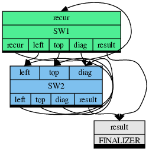

# TTG
This is the C++ API for the Template Task Graph (TTG) programming model for flowgraph-based composition of high-performance algorithms executable on distributed heterogeneous computer platforms. The TTG API abstracts out the details of the underlying task and data flow runtime; the current realization is implemented using [MADNESS](https://github.com/m-a-d-n-e-s-s/madness) and [PaRSEC](https://bitbucket.org/icldistcomp/parsec.git) runtimes as backends.

# Why TTG?

- TTG marries the idea of flowgraph programming models with the key innovations in the PARSEC runtime for compact specification of DAGs (PTG).
- TTG can be used to efficiently compose and execute irregular computation patterns which are poorly served by the current programming and execution models.
- TTG has strong support for distributed hybrid architectures for running modern scientific algorithms efficiently on current and near-future supercomputers. 

# Installation

- To try out TTG in a Docker container, install Docker, then execute `bin/docker-build.sh` and follow instructions in `bin/docker.md`;
- See [INSTALL.md](https://github.com/TESSEorg/ttg/blob/master/INSTALL.md) to learn how to build and install TTG.

# Key Concepts of TTG

- `TaskId` (aka `Key`): A unique identifier for each task. It should be hashable. For example, if computing a matrix multiplicaion, TaskId could be a triplet of integers identifying the tiles being operated upon.
- `Terminal`: Input and output arguments are exposed by the runtime as terminals. Input terminal is a single assignment variable and is used by the runtime to determine when arguments of a task are available. An input terminal is programmable. For example, it could perform a reduction operation.
- `Edge`: An output terminal is connected to the input terminal using edges. Multiple edges can connect to an input terminal enabling data to come from multiple sources and an output terminal might connect to multiple successors implying a broadcast operation.
- `TemplateTask` (aka `TT`): This is a _template_ for creating tasks; its member function `op` defined the body of the task. It is typically created by wrapping a user-defined callable (free function or a lambda) with informal signature `void(TaskId, Arg0, Arg1, ..., OutputTerminals)` with `make_tt`. Task template is used to create a task for a given `TaskId` when all input data for the given `TaskId` have been received.

# How to write a simple TTG program?

1. Select the default TTG backend and include the required header files. To select the default backend define one (and only one) of the following macros, best via the command-line argument to the compiler or as an explicit `#define` statement:
    - `TTG_USE_PARSEC`: selects the PaRSEC backend as the default;
    - `TTG_USE_MADNESS`: selects the MADNESS backend as the default (expert-use only).

    For simple programs it is sufficient to include the top-level header file:
    ```cpp
    #include <ttg.h>
    ```
    It is also possible to hardwire the backend selection by including the corresponding backend-specific header directly; there is no need to `#include` the top-level TTG header or to define the backend selection macros:
    - to use PaRSEC backend only, add:
      ```cpp
      #include <ttg/parsec/ttg.h>
      ```
    - to use the MADNESS backend only, add:
      ```cpp
      #include <ttg/madness/ttg.h>
      ```

2. Define a TaskId (Key) class which represents a unique identifier for each task and which is hashable.

3. Define a factory that returns a TemplateTask for every function that runs the computation. Below factory function returns a TemplateTask for recursively exploring the wavefronts of the Smith Waterman algorithm. The code adopts several common design motifs of a TTG program. Complete implementation of the algorithm can be found in the [examples](examples/) directory.

   ```cpp
   template <typename funcT, typename T>
   auto make_sw1(const funcT& func, int block_size, const std::string &a, const std::string &b,
                 int problem_size, ttg::Edge<Key, BlockMatrix<T>>& leftedge, ttg::Edge<Key, BlockMatrix<T>>& topedge,
                 ttg::Edge<Key, BlockMatrix<T>>& diagedge, ttg::Edge<Key, T>& resultedge) {
      auto f = [block_size, problem_size, a, b, func](const Key& key, BlockMatrix<T>&& toporleft,
                  std::tuple<ttg::Out<Key, BlockMatrix<T>>, ttg::Out<Key, BlockMatrix<T>>,
                  ttg::Out<Key, BlockMatrix<T>>, ttg::Out<Key, BlockMatrix<T>>, ttg::Out<Key, T>>& out) {
        // Getting the block coordinates
        auto[i, j] = key;
        int next_i = i + 1;
        int next_j = j + 1;
        int num_blocks = problem_size / block_size;

        BlockMatrix<T> X(block_size, block_size);
        if (i == 0 && j == 0) {
          //No top, left or diagonal blocks
          X = sw_iterative(i, j, X, X, X, X, block_size, a, b, problem_size);
        }
        else if (i == 0) {
          //Only left block, single dependency
          X = sw_iterative(i, j, X, toporleft, X, X, block_size, a, b, problem_size);
        }
        else if (j == 0) {
          //Only top block, single dependency
          X = sw_iterative(i, j, X, X, toporleft, X, block_size, a, b, problem_size);
        }

        //std::cout << X << std::endl;
        if (next_i < num_blocks) {
          //std::cout << "left " << next_i << " " << j << std::endl;
          if (j == 0)  // send top block for next block computation
            ttg::send<0>(Key(next_i, j), X, out);
          else  // send top block for next block computation
            ttg::send<2>(Key(next_i, j), X, out);
        }
        if (next_j < num_blocks) {
          if (i == 0)  // send left block for next block computation
            ttg::send<0>(Key(i, next_j), X, out);
          else  // // send left block for next block computation
            ttg::send<1>(Key(i, next_j), X, out);
        }
        if (next_i < num_blocks && next_j < num_blocks) {
          ttg::send<3>(Key(next_i, next_j), X, out); //send diagonal block for next block computation
        }
  
        if (i == num_blocks - 1 && j == num_blocks - 1)
          ttg::send<4>(Key(i,j), X(block_size-1, block_size-1), out);
      };

      ttg::Edge<Key, BlockMatrix<T>> recur("recur");
      return ttg::make_tt(f, ttg::edges(recur), ttg::edges(recur, leftedge, topedge, diagedge, resultedge), "sw1", {"recur"},
                          {"recur", "leftedge", "topedge", "diagedge", "resultedge"});
   }
   ```

4. Define the edges and verify that the graph is connected in the main program.

   ```cpp
   ttg::initialize(argc, argv, -1);

   ttg::Edge<Key, BlockMatrix<int>> leftedge, topedge, diagedge;
   ttg::Edge<Key, int> resultedge;
   auto s = make_sw1(sw_iterative<int>, block_size, a, b, problem_size, leftedge, topedge,
                     diagedge, resultedge);
   auto s1 = make_sw2(sw_iterative<int>, block_size, a, b, problem_size, leftedge, topedge,
                     diagedge, resultedge);
   auto r = make_result(verify, val1, resultedge);

   auto connected = ttg::make_graph_executable(s.get());
   assert(connected);
   std::cout << "Graph is connected.\n";
   ```

5. Execute the graph.

   ```cpp
   if (ttg::default_execution_context().rank() == 0)
     s->in<0>()->send(Key(0,0), BlockMatrix<int>());

   ttg::execute();
   ttg::fence();
   ```

## Task Graph Visualization

The task graph can be dumped into a DOT format using the below code in the main program after connecting the graph. [GraphViz](https://www.graphviz.org/) tools can be used to visualize the task graph.

```cpp
std::cout << "==== begin dot ====\n";
std::cout << ttg::Dot()(s.get()) << std::endl;
std::cout << "==== end dot ====\n";
```

Below is a TTG graph generated by Smith Waterman algorithm. Each operation/TemplateTask factory is denoted by a rectangle with input terminals on the top and output terminals listed on the bottom part of the rectangle.



# TTG reference documentation
TTG API documentation is available for the following versions:
- [master branch](https://tesseorg.github.io/ttg/dox-master) .

# Cite

When referring to TTG in an academic setting please cite the following publication:
- G. Bosilca, R. J. Harrison, T. Herault, M. M. Javanmard, P. Nookala and E. F. Valeev, "The Template Task Graph (TTG) - an emerging practical dataflow programming paradigm for scientific simulation at extreme scale," 2020 IEEE/ACM Fifth International Workshop on Extreme Scale Programming Models and Middleware (ESPM2), 2020, pp. 1-7, doi: [10.1109/ESPM251964.2020.00011](https://dx.doi.org/10.1109/ESPM251964.2020.00011).

# Acknowledgment

The development of TTG was made possible by:
- [The EPEXA project](https://tesseorg.github.io/), currently supported by the National Science Foundation under grants [1931387](https://www.nsf.gov/awardsearch/showAward?AWD_ID=1931387) at Stony Brook University, [1931347](https://www.nsf.gov/awardsearch/showAward?AWD_ID=1931347) at Virginia Tech, and [1931384](https://www.nsf.gov/awardsearch/showAward?AWD_ID=1931384) at the University of Tennesse, Knoxville.
- The TESSE project, supported by the National Science Foundation under grants [1450344](https://www.nsf.gov/awardsearch/showAward?AWD_ID=1450344) at Stony Brook University, [1450262](https://www.nsf.gov/awardsearch/showAward?AWD_ID=1450262) at Virginia Tech, and [1450300](https://www.nsf.gov/awardsearch/showAward?AWD_ID=1450300) at the University of Tennesse, Knoxville.
