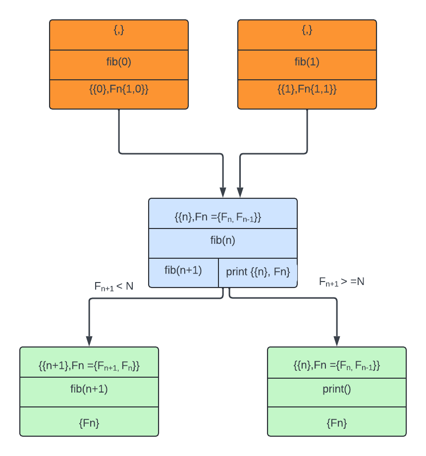

# TTG
This is the C++ API for the Template Task Graph (TTG) programming model for flowgraph-based composition of high-performance algorithms executable on distributed heterogeneous computer platforms. The TTG API abstracts out the details of the underlying task and data flow runtime; the current realization is implemented using [MADNESS](https://github.com/m-a-d-n-e-s-s/madness) and [PaRSEC](https://bitbucket.org/icldistcomp/parsec.git) runtimes as backends.

# Why TTG?

TTG might be for you if you want fine-grained parallel execution of complex (especially, data-dependent) algorithms on distributed-memory heterogeneous machines, for these reasons:

  - programming models that target fine-grained parallelism, like native language tools (threads, async) and programming models/libraries (OpenMP, TaskFlow, Cilk, etc.) deal only with control flow, and thus are poorly suited for dealing with data-dependent execution
  - such models do not deal with distributed memory anyway
  - and specialized runtimes like StarPU, PaRSEC, MADNESS, HPX, UPC++, etc., are still relatively low-level abstractions for expressing complex data-dependent task flows across modern distributed heterogeneous machines.

The development of TTG was motivated by _irregular_ scientific applications like adaptive multiresolution numerical calculus and data-sparse tensor algebra which have lacked tools to keep up with the evolution of HPC platforms, especially toward heterogeneity. But TTG is far more widely applicable than that; it is a general-purpose programming model.

# Installation

- To try out TTG in a Docker container, install Docker, then execute `bin/docker-build.sh` and follow instructions in `bin/docker.md`;
- See [INSTALL.md](https://github.com/TESSEorg/ttg/blob/master/INSTALL.md) to learn how to build and install TTG.

# A Short Intro to TTG

## TL;DR: A "Hello, World" TTG Program

`helloworld.cpp`

```cpp
#include <ttg.h>

int main(int argc, char *argv[]) {
  ttg::initialize(argc, argv);

  auto tt = ttg::make_tt([]() { std::cout << "Hello, World!\n"; });

  ttg::make_graph_executable(tt);
  ttg::execute();
  if (ttg::get_default_world().rank() == 0) tt->invoke();
  ttg::fence();

  ttg::finalize();
  return 0;
}
```

`CMakeLists.txt`

```cmake
cmake_minimum_required(VERSION 3.19)
project(TTG-HW CXX)

find_package(ttg QUIET) # check if TTG is already available
if (NOT TARGET ttg-parsec) # else build from source
  include(FetchContent)
  FetchContent_Declare(ttg GIT_REPOSITORY https://github.com/TESSEorg/ttg.git)
  FetchContent_MakeAvailable( ttg )
endif()

add_executable(helloworld-parsec helloworld.cpp)
target_link_libraries(hw-parsec PRIVATE ttg-parsec)
target_compile_definitions(hw-parsec PRIVATE TTG_USE_PARSEC=1)
```

Configure + build:

```sh
> cmake -S . -B build && cmake --build build --target helloworld-parsec
```

The complete example, including the CMake build harness using a slightly easier way to build the executable (using `add_ttg_executable` CMake macro), can be found in [dox examples](https://github.com/TESSEorg/ttg/tree/master/doc/dox/dev/devsamp/helloworld).

## "Hello, World!" Walkthrough

Although it does not involve any useful flow of computation and/or data, the above "Hello, World!" TTG program introduces several key TTG concepts and illustrates what you need to do to write a complete TTG program. So let's walk through it.

### Programming Model

The basic model of computation is built around a Template Task Graph (TTG). A TTG consists of one or more connected Template Task (TT) objects. Each message that travels between TTs consist of a (potentially void) task ID and (optional) datum. A TT creates a task for a given task ID when its every input terminal receives a message with that task ID. The task body can send data to zero or more of the output terminals defined for the corresponding TT.

Thus, task creation is a byproduct of messages traveling through one or more TTGs. What makes the model powerful is the ability to encode large DAGs of tasks compactly.

Before proceeding further, let's refine the few concepts used to define the programming model above:

- `TaskId` (aka `Key`): A unique identifier for each task. It must be _perfectly_ hashable.
- `Terminal`: A port for receiving (input)  and sending (output) messages. Each message consists of a (potentially void) `TaskId` and an (optional) datum. Terminals are strongly-typed. An {in,out}put terminal can be connected to one or more {out,in}put terminal (as long as the `TaskId` and datum types match). Input terminals are programmable (e.g., incoming messages can be optionally reduced).
- `TemplateTask` (aka `TT`): This is a _template_ for creating tasks. Task template creates a task associated with a given `TaskId` when every input terminal received messages for the given `TaskId`.
- `Edge`: A connection between an input terminal and an output terminal. N.B. Concept `Edge` denotes a 1-to-1 connection and exists to be able to think of TTGs as graphs ("data flows between TTs' terminals via Edges"); do not confuse with the TTG C++ class `Edge` which behaves like a hyperedge by composing 1-to-many and many-to-1 connections between terminals.

Due to its simplicity only template tasks appear in the "Hello, World!" program.

## Structure of a Minimal TTG Program

Every TTG program must:

- select the TTG backend,
- initialize the TTG runtime,
- construct a TTG by declaring its constituent nodes,
- make TTG executable and kickstart the execution by sending a control or data message to the TTG,
- shut down the runtime

Let's go over each of these steps using the "Hello, World!" example. The complete example, including the CMake build harness, can be found in [dox examples](https://github.com/TESSEorg/ttg/tree/master/doc/dox/dev/devsamp/fibonacci).

### Select the TTG Backend

TTG C++ implementation is currently supported by 2 backends providing task scheduling, data transfer, and resource management.
While it is possible to use specific TTG backend explicitly, by using the appropriate namespaces, it is recommended to write backend-neutral programs that can be specialized to a particular backend as follows.

  1. By defining one (and only one) of the following macros, via the command-line argument to the compiler (recommended) or as an explicit `#define` statement in the source code:
    - `TTG_USE_PARSEC`: selects the PaRSEC backend as the default;
    - `TTG_USE_MADNESS`: selects the MADNESS backend as the default (expert-use only).

      Following the definition of this macro it is safe to include the top-level TTG header file:

      ```cpp
      #include <ttg.h>
      ```

  2. By including the corresponding backend-specific header directly:
    - to use PaRSEC backend only, add:

      ```cpp
      #include <ttg/parsec/ttg.h>
      ```

    - to use the MADNESS backend only, add:

      ```cpp
      #include <ttg/madness/ttg.h>
      ```

   This approach does not require inclusion of the top-level TTG header or definition of a backend selection macro.

### Initialize

To initialize TTG runtime invoke `ttg::initialize(argc, argv)`; there are several overloads of this function that also accept other optional parameters, such as the number of threads in the main thread pool, the MPI communicator for execution, etc.

## Specify a TTG

To make a TTG create and connect one or more TTs. The simplest TTG consists of a single TT.

The "Hello, World!" example contains a single TT that executes a single task (hence, task ID can be omitted, i.e., void) that does not take and produce any data. The easiest way to make such a TT  is by wrapping a callable (e.g., a lambda) with `ttg::make_tt`:

```cpp
  auto tt = ttg::make_tt([]() { std::cout << "Hello, World!\n"; });
```

## Execute TTG

To execute a TTG we must make it executable (this will declare the TTG  program complete so no additional changes to the flowgraph are possible). To execute the TTG its root TT must receive at least one message; since in this case the task does not receive either task ID or data the message is empty (i.e., void):

```cpp
  ttg::make_graph_executable(tt);
  ttg::execute();
  if (ttg::get_default_world().rank() == 0)
      tt->invoke();
```

`ttg::execute()` must occur before, not after, sending any messages. Note also that we must ensure that only one such message must be generated. Since TTG execution uses the Single Program Multiple Data (SPMD) model,
when launching the TTG program as multiple processes only the first process (rank) gets to send the message.

## Finalize TTG
Since TTG program is executed asynchronously, we must ensure that all tasks are finished:

```cpp
  ttg::fence();
```

Before exiting `main()` the TTG runtime should be finalized:

```cpp
  ttg::finalize();
```

## Beyond "Hello, World!"

Since "Hello, World!" consists of a single task it does not demonstrate either how to control scheduling of
multiple tasks or enable data flow between tasks. Let's use computation of `N`th Fibonacci number as
a simple example of a recursive task-based computation that is often used
([OpenMP](https://www.openmp.org/wp-content/uploads/openmp-examples-5.1.pdf),
[TBB](https://github.com/oneapi-src/oneTBB/blob/master/examples/test_all/fibonacci/fibonacci.cpp),
[Legion](https://legion.stanford.edu/tutorial/tasks_and_futures.html),
[Cilk](https://cilk.mit.edu/programming/)) to illustrate basic features of task-based programming models.
Although the example lacks opportunity for parallelism,  the point here is not performance but its simplicity.

### Example: `N`th Fibonacci Number

This example illustrates how to compute a particular element of the Fibonacci sequence
defined by recurrence
$F_N = F_{N-1} + F_{N-2}, F_0=0, F_1=1$.

`nth-fibonacci.cpp`

```cpp
#include <ttg.h>

int main(int argc, char *argv[]) {
  ttg::initialize(argc, argv);

  const int64_t N = 20;
  ttg::Edge<int64_t, int64_t> f2f_nm1, f2f_nm2;
  ttg::Edge<void, int64_t> f2p;
  auto fib = ttg::make_tt(
      [=](int64_t n, int64_t F_nm1, int64_t F_nm2) {
        auto F_n = F_nm1 + F_nm2;
        if (n < N) {
          ttg::send<0>(n + 1, F_n);
          ttg::send<1>(n + 1, F_nm1);
        } else
          ttg::sendv<2>(F_n);
      },
      ttg::edges(f2f_nm1, f2f_nm2), ttg::edges(f2f_nm1, f2f_nm2, f2p),
      "fib");
  auto print = ttg::make_tt([](int64_t F_N) { std::cout << N << "th Fibonacci number is " << F_N << std::endl; },
                            ttg::edges(f2p),
                            ttg::edges(),
                            "print");

  ttg::make_graph_executable(fib);
  ttg::execute();
  if (ttg::rank() == 0) fib->invoke(2, std::make_tuple(1, 0));
  ttg::fence();

  ttg::finalize();
  return 0;
}
```

The TTG consists of 2 TTs, one (`fib`) that implements the Fibonacci recurrence and another (`print`) that prints the result to
`std::cout`:
  
  - `fib` computes $F_{n}$ from $F_{n-1}$ and $F_{n-2}$ and either sends $F_{n}$ and $F_{n-1}$ to the next ($n+1$)
  instance of `fib`, or, if $n=N$, sends $F_{n}$ to `print`. Thus `fib`
  needs 2 input terminals and 3 output terminals (for better efficiency instead of sending individual  Fibonacci numbers, each over an individual edge, it is better to send a pair of Fibonacci numbers over a single edge).
  - `print` receives a single unannotated datum and produces no data, so it needs a single input terminal and no output terminals.

Execution of the program starts by explicitly instantiating `fib` for $n=2$.
In total 20 tasks will be executed: 19 instances of `fib` with $n=2\dots20$ and the single instance of `print`.

Note that unlike typical task-based implementations in the literature which construct tasks _recursively_, i.e., the task for
computing $F_{n}$ is created before the task computing $F_{n-1}$, the TTG implementation constructs the tasks in the order of increasing $n$. This is because parametric dataflow of TTG naturally expresses inductive (push) computation patterns rather than recursive (pull) computation patterns. However, it is easy to implement proper recursion by separating the downward flow of control (task creation, $F_{n} \to F_{n-1},F_{n-2}$)
from the upward flow of data (task evaluation,
$F_{n-1},F_{n-2} \to F_{n}$).

## Data-Dependent Example : Largest Fibonacci Number < N

To illustrate the real power of TTG let's tweak the problem slightly: instead of computing first $N$ Fibonacci numbers let's find the largest Fibonacci number smaller than some $N$. The key difference in the latter case is that, unlike the former, the number of tasks is NOT known a priori; furthermore, to make a decision whether we need to compute next Fibonacci number we must examine the value returned by the previous task. This is an example of data-dependent tasking, where the decision which (if any) task to execute next depends on the values produced by previous tasks. The ability to compose regular as well as data-dependent task graphs is a distinguishing strength of TTG.

To make things even more interesting, we will demonstrate how to implement such program both for execution on CPUs as well as on accelerators (GPUs).
The complete examples, including the CMake build harness, can be found in [dox examples](https://github.com/TESSEorg/ttg/tree/master/doc/dox/dev/devsamp/fibonacci).

### The CPU Version

```cpp
#include <ttg.h>
#include "ttg/serialization.h"

/// N.B. contains values of F_n and F_{n-1}
struct Fn {
  int64_t F[2];  // F[0] = F_n, F[1] = F_{n-1}
  Fn() { F[0] = 1; F[1] = 0; }
  template <typename Archive>
  void serialize(Archive& ar) {
    ar & F;
  }
  template <typename Archive>
  void serialize(Archive& ar, const unsigned int) {
    ar & F;
  }
};

auto make_ttg_fib_lt(const int64_t) {
  ttg::Edge<int64_t, Fn> f2f;
  ttg::Edge<void, Fn> f2p;

  auto fib = ttg::make_tt(
      [=](int64_t n, Fn&& f_n) {
        int64_t next_f_n = f_n.F[0] + f_n.F[1];
        f_n.F[1] = f_n.F[0];
        f_n.F[0] = next_f_n;
        if (next_f_n < F_n_max) {
          ttg::send<0>(n + 1, f_n);
        } else {
          ttg::send<1>(n, f_n);
        }
      },
      ttg::edges(f2f), ttg::edges(f2f, f2p), "fib");

  auto print = ttg::make_tt(
      [=](Fn&& f_n) {
        std::cout << "The largest Fibonacci number smaller than " << F_n_max << " is " << f_n.F[1] << std::endl;
      },
      ttg::edges(f2p), ttg::edges(), "print");
  auto ins = std::make_tuple(fib->template in<0>());
  std::vector<std::unique_ptr<ttg::TTBase>> ops;
  ops.emplace_back(std::move(fib));
  ops.emplace_back(std::move(print));
  return make_ttg(std::move(ops), ins, std::make_tuple(), "Fib_n < N");
}

int main(int argc, char* argv[]) {
  ttg::initialize(argc, argv, -1);
  int64_t N = 1000;
  if (argc > 1) N = std::atol(argv[1]);

  auto fib = make_ttg_fib_lt(N);
  ttg::make_graph_executable(fib.get());
  ttg::execute();
  if (ttg::default_execution_context().rank() == 0)
    fib->template in<0>()->send(1, Fn{});;

  ttg::fence();
  ttg::finalize();
  return 0;
}
```

[//]: # (TODO: walk through the example, key things to emphasize:)

[//]: # (- `Fn` aggregates 2 pieces of data that were separate before in preparation for aggregating datums into single continguous chunks that can be allocated on GPU more efficiently)

[//]: # (- `make_ttg_fib_lt` creates a TTG composed of multiple TTs, whereas before we had disparate TTs connected to each other &#40;i.e. there was no explicit graph object&#41;. This allows to support composition of multiple TTGs together, as described in Herault et al DOI 10.1109/PAW-ATM56565.2022.00008)

#### Utility of `Fn` struct
`Fn` aggregates 2 pieces of data that were separate before in preparation for aggregating datums into single continguous chunks that can be allocated on GPU more efficiently.This arrangement allows each task to access and modify both current and previous Fibonacci values without the need for separate data fields or additional communication overhead.

- `F[0]` and `F[1]` store the current ($F_n$) and previous ($F_{n-1}$) Fibonacci numbers, respectively.
- The default constructor starts the iteration by initializing `F[0]=1` and `F[1]=0`.

Because `Fn` is now a user-defined type, for TTG to be able to copy/move it between tasks it needs to know how to serialize and deseralize it.
 functions are useful to communicate the struct among the tasks. TTG leverages these functions to serialize and deserialize the data as it is sent and received through the task graph.

#### Why `make_ttg_fib_lt`?

Until now we have constructed individual TTs and linked them together; i.e.,  TTGs until now was implicit. Function `make_ttg_fib_lt` instead explicitly creates a graph of TTs (a TTG). This seemingly small step helps improve composability by allowing to use entire TTGs as a component of other graphs by stitching it with TTs or TTGs together.

[//]: 

###  Device Version

It is currently not possible to have a general-purpose task runtime execute purely on device, hence TTG and the underlying runtimes execute tasks on the host (CPU), and these tasks launch device _kernels_. For technical reasons it is necessary to split the code into the host-only part, which looks remarkably like the CPU-only version above, and the device-specific part that implements the core part of the computation on the device. In the future it _may_ become possible to have single-source programs that contain both host and device parts contain in the same source file.

####  Host-side Code

The host-only part is completely independent of the type of the device programming model.

```cpp
struct Fn : public ttg::TTValue<Fn> {
  std::unique_ptr<int64_t[]> F;  // F[0] = F_n, F[1] = F_{n-1}
  ttg::Buffer<int64_t> b;
  Fn() : F(std::make_unique<int64_t[]>(2)), b(F.get(), 2) { F[0] = 1; F[1] = 0; }
  Fn(const Fn&) = delete;
  Fn(Fn&& other) = default;
  Fn& operator=(const Fn& other) = delete;
  Fn& operator=(Fn&& other) = default;
  template <typename Archive>
  void serialize(Archive& ar) {
    ttg::ttg_abort();
  }
  template <typename Archive>
  void serialize(Archive& ar, const unsigned int) {
    ttg::ttg_abort();
  }
};

auto make_ttg_fib_lt(const int64_t F_n_max = 1000) {
  ttg::Edge<int64_t, Fn> f2f;
  ttg::Edge<void, Fn> f2p;

  auto fib = ttg::make_tt<ES>(
      [=](int64_t n, Fn&& f_n) -> ttg::device::Task {
        assert(n > 0);
        ttg::trace("in fib: n=", n, " F_n=", f_n.F[0]);

        co_await ttg::device::select(f_n.b);

        next_value(f_n.b.current_device_ptr());

        // wait for the task to complete and the values to be brought back to the host
        co_await ttg::device::wait(f_n.b);

        if (f_n.F[0] < F_n_max) {
          co_await ttg::device::forward(ttg::device::send<0>(n + 1, std::move(f_n)));
        } else {
          co_await ttg::device::forward(ttg::device::sendv<1>(std::move(f_n)));
        }
      },
      ttg::edges(f2f), ttg::edges(f2f, f2p), "fib");
  auto print = ttg::make_tt(
      [=](Fn&& f_n) {
        std::cout << "The largest Fibonacci number smaller than " << F_n_max << " is " << f_n.F[1] << std::endl;
      },
      ttg::edges(f2p), ttg::edges(), "print");

  auto ins = std::make_tuple(fib->template in<0>());
  std::vector<std::unique_ptr<::ttg::TTBase>> ops;
  ops.emplace_back(std::move(fib));
  ops.emplace_back(std::move(print));
  return make_ttg(std::move(ops), ins, std::make_tuple(), "Fib_n < N");
}

int main(int argc, char* argv[]) {
  ttg::initialize(argc, argv, -1);
  int64_t N = 1000;
  if (argc > 1) N = std::atol(argv[1]);

  auto fib = make_ttg_fib_lt(N);
  ttg::make_graph_executable(fib.get());
  ttg::execute();
  if (ttg::default_execution_context().rank() == 0)
    fib->template in<0>()->send(1, Fn{});;

  ttg::fence();
  ttg::finalize();
  return 0;
}
```

Although the structure of the device-capable program is nearly identical to the CPU version, there are important differences:

  - `Fn`'s data must exist on the host side (where the task is executed). To automate moving of the data between host and device memories `Fn` is implemented with the help of helper classes `TTValue` and `Buffer`.
  - task functions become _coroutines_ (as indicated by their return type `device::Task`) to deal with the asynchrony of the host-device interactions (kernel launch, memory allocation and transfers)
  - the target execution space is specified as a template argument of type `ExecutionSpace` to `make_tt`

##### `TTValue`

For optimal performance low-level runtime that manages the data motion across the memory hierarchy (host-to-host (i.e., between MPI ranks), host-to-device, and device-to-device) must be able to _track_ each datum as it orchestrates the computation. For example, when a TTG task `send`'s a datum to an output terminal connected to multiple consumers the runtime may avoid unnecessary copies, e.g. by recognizing that all consumers will only need read-only access to the data, hence reference to the same datum can be passed to all consumers. This requires being able to map pointer to a C++ object to the control block that describes that object to the runtime. Deriving C++ type `T` from `TTValue<T>` makes it possible to track objects `T` by embedding the control block into each object. This is particularly important for the data that has to travel to the device.

##### `Buffer`
`Buffer<T>` is a view of a contiguous sequence of objects of type `T` in the host memory that can be automatically moved by the runtime to/from the device memory. Here `Fn::b` is a view of the 2-element sequence pointed to by `Fn::F`; once it's constructed the content of `Fn::F` will be moved to/from the device by the runtime. The subsequent actions of `Fn::b` cause the automatic transfers of data to (`device::select(f_n.b)`) and from (`ttg::device::wait(f_n.b)`) the device.

##### `device::Task`

The key challenge of device programming models is that they are fundamentally _asynchronous_ to hide the large latency of interacting with the device. Kernel launches, unlike function calls on CPU, take 1000s of CPU cycles to occur, and the asynchrony helps amortize these costs by overlapping kernels launch and execution. Task programming models are a seemingly good match for device programming, but the key challenge is how to make device-capable task code look most like standard host-only task code. TTG ability to use _C++ coroutines_ as task bodies allows it to deal with asynchronous calls inside the tasks (the use of coroutines is the primary reason why TTG requires C++20 support by the C++ compiler). Roughly speaking, coroutines are resumable functions; they can return to the caller via a `co_await` statement and resumed at that point once some condition (typically, completion of submitted actions) has been satisdied. Device tasks `co_await` at every point where further progress requires completion of preceding device tasks:

  - First `co_await` ensures that contents of `f_n.F[]` are available on the device. During the first invocation the data resides on the host, hence this allocates memory on the device and transfers the contents of `f_n.F[]` from host to device. During subsequent invocations the contents of `f_n.F[]` are likely already available on the device (unless the runtime decides to compute $F_{n+1}$ on a different device than $F_n$), thus this `co_await` may become a no-op.
  - Second `co_await` ensures that the kernel launched by `next_value` has completed and the contents of `f_n.F[]` changed by that kernel are available on the host. This always causes device-to-host transfer.
  - Third set of `co_await`'s ensures that the corresponding `device::send`, which sends the data located in the device memory, has completed. Since `device::send` within a task will typically return a local variable exit from coroutine would destroy such variables prematurely, hence instead of a `co_return` the coroutine concludes by waiting for the `device::send` to complete before exiting.

##### `ExecutionSpace`

TTG and its underlying runtime needs to be told in which _execution space_ the task code will operate. The current choices are denoted by the `ExecutionSpace` enumeration:

- `ExecutionSpace::Host`: host processor (default)
- `ExecutionSpace::CUDA`: an NVIDIA CUDA device
- `ExecutionSpace::HIP`: an AMD HIP device
- `ExecutionSpace::L0`: an Intel L0 device


[//]: # (Walk through the key differences ... potentially we could show both side by side ... not sure how to do that in Markdown though ...)

####  Device Kernel

Here's the CUDA version of the device kernel and its host-side wrapper; ROCm and SYCL/Level0 variants will be very similar to the CUDA version:

```cpp
#include "fibonacci_cuda_kernel.h"
#ifdef TTG_HAVE_CUDA
    __global__ void cu_next_value(int64_t* fn_and_fnm1) {
      int64_t fnp1 = fn_and_fnm1[0] + fn_and_fnm1[1];
      fn_and_fnm1[1] = fn_and_fnm1[0];
      fn_and_fnm1[0] = fnp1;
    }
    void next_value(int64_t* fn_and_fnm1) {
      cu_next_value<<<1, 1>>>(fn_and_fnm1);
    }
#endif // TTG_HAVE_CUDA
```

`cu_next_value` is the device kernel that evaluates $F_{n+1}$ from $F_{n}$ and $F_{n-1}$. `next_value` is a host function that launches `cu_next_value`; this is the function called in the `fib` task.

## Debugging TTG Programs

### TTG Visualization

TTGs can be exported in [the DOT format](https://en.wikipedia.org/wiki/DOT_(graph_description_language)) as follows:

```cpp
std::cout << ttg::Dot()(tt.get()) << std::endl;
```

Use [GraphViz](https://www.graphviz.org/) to visualize the resulting graph.

### Task Graph Visualization

Exporting the DAG of tasks resulting from execution of a TTG will be possible as soon as [PR 227](https://github.com/TESSEorg/ttg/pull/227) has been merged.

### Launching a Debugger
To simplify debugging of multirank TTG programs it is possible to automate the process as follows:
- If an X11 server is running (check if environment variable `DISPLAY` is set), then set environment variable `TTG_DEBUGGER` to {`gdb_xterm`,`lldb_xterm`} to launch {`gdb`,`lldb`} upon receiving a signal like `SIGSEGV` or `SIGABRT` (one `xterm` window per rank will be created);
- If an X11 server is not running the set `TTG_DEBUGGER` to empty value; upon receiving a signal the program will print instructions for how to attach a debugger to a running process from another terminal.
- run the ttg program and if it receives any signal the xterm windows should pop up to display debugging results

# TTG Performance

Competitive performance of TTG for several paradigmatic scientific applications on shared- and distributed-memory machines (CPU only)
will be discussed in [manuscript ``Generalized Flow-Graph Programming Using Template Task-Graphs: Initial Implementation and Assessment''](https://www.ipdps.org/ipdps2022/2022-accepted-papers.html) to be presented at [IPDPS'22](https://www.ipdps.org/ipdps2022/).
Stay tuned!

# TTG Performance Tracing

There are several ways to trace execution of a TTG program. The easiest way is to use the PaRSEC-based TTG backend to
produce binary traces in PaRSEC Binary Trace (PBT) format and then convert them to
a Chrome Trace Format (CTF) JSON file that can be visuzalized using built-in browser
in Chrome browser or using web-based [Perfetto trace viewer](https://ui.perfetto.dev/).
To generate the trace results of any TTG program follow the process discussed below:

- For simplicity we assume here that TTG will build PaRSEC from source. Make sure PaRSEC Python tools prerequisites have been installed, namely Python3 (version 3.8 is recommended) and the following Python packages (e.g., using `pip`):
  - `cython`
  - `2to3`
  - `numpy`
  - `pandas`
  - `tables`
- Configure and build TTG:
  - Configure TTG with `-DPARSEC_PROF_TRACE=ON` (this turns on PaRSEC task tracing) and `-DBUILD_SHARED_LIBS=ON` (to support PaRSEC Python tools). Also make sure that CMake discovers the Python3 interpreter and the `cython` package.
  - Build and install TTG
- Build the TTG program to be traced.
- Run the TTG program with tracing turned on:
  - Create file `${HOME}/.parsec/mca-params.conf` and add line `mca_pins = task_profiler` to it
  - Set the environment variable `PARSEC_MCA_profile_filename` to the PBT file name _prefix_, e.g. `/tmp/ttg`.
  - Run the program and make sure the trace files (in PBT format) have been generated; e.g., if you set `PARSEC_MCA_profile_filename` to `/tmp/ttg` you should find file `/tmp/ttg-0.prof-...` containing the trace from MPI rank 0, `/tmp/ttg-1.prof-...` from rank 1, and so on.
- Convert the traces from PaRSEC Binary Trace (PBT) format to the Chrome Trace Format (CTF):
  - Add `{TTG build directory}/_deps/parsec-build/tools/profiling/python/build/{lib folder for your version of Python}` (currently it is not possible to use PaRSEC Python module from the install tree, only from its build tree)
 to the `PYTHONPATH` environment variable so that the Python  interpreter can find the modules for reading the PaRSEC trace files.
  - Convert the PBT files to a CTF file by running the conversion script:
```
 {TTG install prefix}/bin/pbt_to_ctf.py {PBT file name prefix} {CTF filename}
```
- Open the `chrome://tracing` URL in the Chrome browser and load the resulting trace; alternatively you can use the [Perfetto trace viewer](https://ui.perfetto.dev/) from any browser.

For example, executing the Fibonacci program described above using 2 MPI processes and with 2 threads each will produce a trace that looks like this:

 

# TTG reference documentation

TTG API documentation is available for the following versions:

- [master branch](https://tesseorg.github.io/ttg/dox-master) .

# Cite

When referring to TTG in an academic setting please cite the following publication:
- G. Bosilca, R. J. Harrison, T. Herault, M. M. Javanmard, P. Nookala and E. F. Valeev, "The Template Task Graph (TTG) - an emerging practical dataflow programming paradigm for scientific simulation at extreme scale," 2020 IEEE/ACM Fifth International Workshop on Extreme Scale Programming Models and Middleware (ESPM2), 2020, pp. 1-7, doi: [10.1109/ESPM251964.2020.00011](https://dx.doi.org/10.1109/ESPM251964.2020.00011).

# Acknowledgment

The development of TTG was made possible by:

- [The EPEXA project](https://tesseorg.github.io/), currently supported by the National Science Foundation under grants [1931387](https://www.nsf.gov/awardsearch/showAward?AWD_ID=1931387) at Stony Brook University, [1931347](https://www.nsf.gov/awardsearch/showAward?AWD_ID=1931347) at Virginia Tech, and [1931384](https://www.nsf.gov/awardsearch/showAward?AWD_ID=1931384) at the University of Tennesse, Knoxville.
- The TESSE project, supported by the National Science Foundation under grants [1450344](https://www.nsf.gov/awardsearch/showAward?AWD_ID=1450344) at Stony Brook University, [1450262](https://www.nsf.gov/awardsearch/showAward?AWD_ID=1450262) at Virginia Tech, and [1450300](https://www.nsf.gov/awardsearch/showAward?AWD_ID=1450300) at the University of Tennesse, Knoxville.
